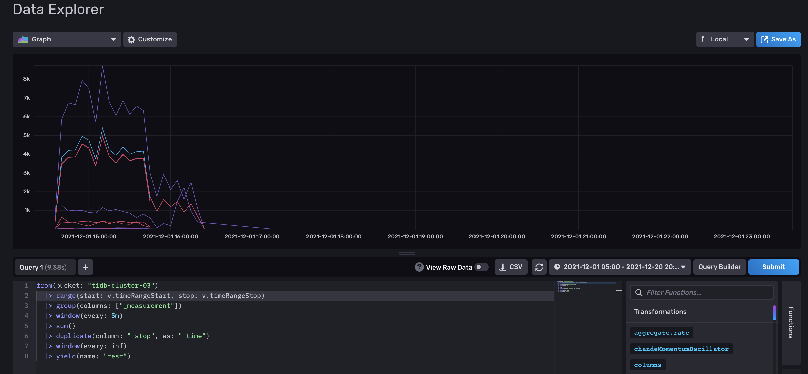

[](https://github.com/pingcap/tiup/blob/master/LICENSE)
[](https://golang.org/)

# Naglfar

> TiDB Hackathon 2021 参赛项目

@lucklove @shhdgit @yanggno @DaGuo97

## 项目进展

- [ ] 设计文档
- [ ] 日志解析器，实现从行文本到日志 id 的映射，[已部分完成](https://github.com/lucklove/tidb-log-parser)
    - [ ] 改造 parser，输入日志，输出 time, id
- [ ] 健康度建模
- [ ] 前端展示（待细化）

## 项目介绍

Naglfar(纳迦法) 的定位是一款 TiDB 专属的日志分析工具，用于帮助用户快速掌握日志，定位日志中可能存在的问题，降低日志阅读的负担。

## 背景&动机

和大多数服务端软件一样，TiDB 也在时时刻刻通过日志来暴露自己内部的状态。而和其他服务不太一样的是，TiDB 在 2019 年进行了一次[日志格式大改造](https://github.com/tikv/rfcs/blob/master/text/0018-unified-log-format.md)，这次改造将原本非结构化的日志结构化了，变成了程序可解析的格式，为通过日志进行数据挖掘提供了可能。

## 项目设计

### 日志解析与聚类

一段符合 [TiDB Log Format](https://github.com/tikv/rfcs/blob/master/text/0018-unified-log-format.md) 的日志由若干行构成，每行都是独立的一条日志，但两行日志可能具有同样的模式，例如：

```
[2021/12/19 16:17:30.204 +08:00] [INFO] [ddl_worker.go:154] ["[ddl] start DDL worker"] [worker="worker 1, tp general"]
[2021/12/19 16:17:30.204 +08:00] [INFO] [ddl_worker.go:154] ["[ddl] start DDL worker"] [worker="worker 2, tp add index"]
```

虽然这两行日志字符串并不相等，但是他们具有同样的模式：

```
[{time}] [INFO] [ddl_worker.go:154] ["[ddl] start DDL worker"] [worker="{worker}"]
```

如果我们把变量去掉，留下不变的部分，就能将具有相同模式的日志聚类到一起。对于符合 TiDB Log Format 格式的日志，可以映射为以下结构体：

```golang
type LogEntry struct {
        Header  LogHeader
        Message string
        Fields  []LogField
}

type LogHeader struct {
        DateTime time.Time
        Level    LogLevel
        File     string
        Line     uint
}

type LogField struct {
        Name  string
        Value string
}
```

在聚类过程中，只需要对比两行日志的 Level，Message 和 Fields 的 Key 是否相同就能判断它们是否同一日志。

### 事件转换

在解析日志之后我们拥有了对比两行日志是否同一类的能力，但是还有一个问题需要解决：TiDB 的日志并不是一成不变的，在不同的 TiDB 版本中同一行日志也可能会有所改动，比如 message 中添加/减少/修改单词，fields 中增删变量等等。因此需要有一种方式将变化前后的日志映射成相同的标识符，由于经过日志聚类之后的日志数量是非常有限的（理论上不会超过静态代码中调用 logger 的次数），我们可以通过手动分配 ID 的方式为某一类日志书写规则：

```toml
[[rule]]
id = 1
name = "启动 DDL worker"
  [rule.patterns]
  level = "INFO"
  message = "[ddl] start DDL worker"
  fields = ["worker"]
```

以上规则的含义为：遇到 message 为 "[ddl] start DDL worker" 且含有 "worker" 这个 fields 的日志，就为其分配 id 为 1 的事件。如果将来日志发生了改变，比如 message 中去掉了 [ddl] 变成了：

```toml
[2021/12/19 16:17:30.204 +08:00] [INFO] [ddl_worker.go:154] ["start DDL worker"] [worker="worker 1, tp general"]
```

这个时候我们就会遇到一条无法识别的日志，可以通过编辑距离算法来发现 "start DDL worker" 和 "[ddl] start DDL worker" 非常近似，这个时候就可以手动添加一条新的规则将 "start DDL worker" 的 ID 也映射成 1：

```toml
[[rule]]
id = 1
name = "启动 DDL worker"
  [rule.patterns]
  level = "INFO"
  message = "[ddl] start DDL worker"
  fields = ["worker"]

[[rule]]
id = 1
name = "启动 DDL worker"
  [rule.patterns]
  level = "INFO"
  message = "start DDL worker"
  fields = ["worker"]
```

注意这两条规则的 ID 相同但 message 不同。

在这一步之后，日志片段

```
[2021/12/19 16:17:30.204 +08:00] [INFO] [ddl_worker.go:154] ["[ddl] start DDL worker"] [worker="worker 1, tp general"]
[2021/12/19 16:17:30.204 +08:00] [INFO] [ddl_worker.go:154] ["[ddl] start DDL worker"] [worker="worker 2, tp add index"]
```

可以被映射成事件序列 E1, E1。

### 事件重要程度评估模型（待定）

最朴素的方案可以考虑参考 TF-IDF 算法对给定日志片段算特征值，算法如下：


解释：
- efilf(e,l,L)：对于日志库 L，事件列表 l，事件 e 在 l 中的权重
- ef(e,l)：对于事件列表 l，事件 e 在 l 中的频率
- count(e,l)：对于事件列表 l，事件 e 在 l 中出现的次数
- ilf(e,l)：对于日志库 L，事件  e 在 L 中的逆频率，其中 N 为 L 中的事件列表总数。其计算方法为 N 除以 (含 e 的 l 数量 + 1) 取对数

以上，事件列表 l 指一段连续日志转换成的事件列表。日志库 L 表示历史录入的多个事件列表。

### 日志可视化

例如，日志趋势:

